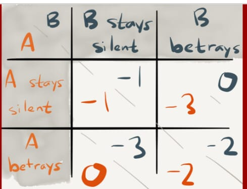

# 课堂练习

1. 市场经济和计划经济:

   A 市场经济是由上而下的经济, 计划经济反之

   B 随着超级计算机和 A 的出现, 计划经济是可行的

   C 计划经济比市场经济更文明, 是未来的超势

   D 市场经济, 基于交易的公平自愿, 将带来双赢

   E 市场经济是人类经济活动的完美解决方案

   

answer

   > D

   

2. 囚徒困境中人做出的选择会属于第几象限?

   

   A 第一象限

   B 第二象限

   C 第三象限

   D 第四象限

   

answer

   > D

   

3. 以下说法中,对的是:

   A 在经济决策中,我们必须考虑全部的因素及其成本, 并平衡所有的利益.

   B 市场经济中,囚徒困境是有害的.

   C 为了得到一件东西,我们通常不得不放弃另一样.

   D 市场是组织经济活动的最好方法.

   E 政府一定会改善市场结果,消除"囚徒的困境".

   

answer

   > C, 来自`经济学原理`

   

4. 营销学中商品的"价值":

   A 凝结在商品中无差别的人类劳动

   B 商品表现出来的积极意义和有用性

   C 主观概念,因人而异

   D 客观概念,基本不变,是价格的锚

   E 取决于生产成本和稀缺性等

   

answer

   > B, C

   

